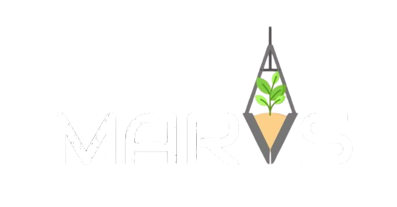

  

# Introduction

This project was developed as part of an undergraduate academic assignment. The objective was to design a robotic manipulator to address a problem of the students' choosing, applying the concepts learned throughout the course.

The MARVS project is a robotic manipulator designed for planting small plants in remote areas via an autonomous robot. See more about the project on the [wiki](https://github.com/Playergeek181/marvs/wiki)

# Team 
| Photo | Name | Contribution | GitHub | LinkedIn | Email |
|-------|------|--------------|--------|----------|-------|
|  | João Aires Corrêa Fernandes Marsicano | Code development | [GitHub](https://github.com/Playergeek181) | [LinkedIn](https://www.linkedin.com/in/joao-aires-marsicano/) | joao.aires.marsicano@usp.br |
|  | Renan Ribeiro Machado | Code development | [GitHub](https://github.com/Rem-Cap) | [LinkedIn](https://www.linkedin.com/in/renan-machado-95178a23b/) | renan_11@usp.br |
> All members are students of Mechatronic Engineering at the University of São Paulo, School of Engineering in São Carlos.
